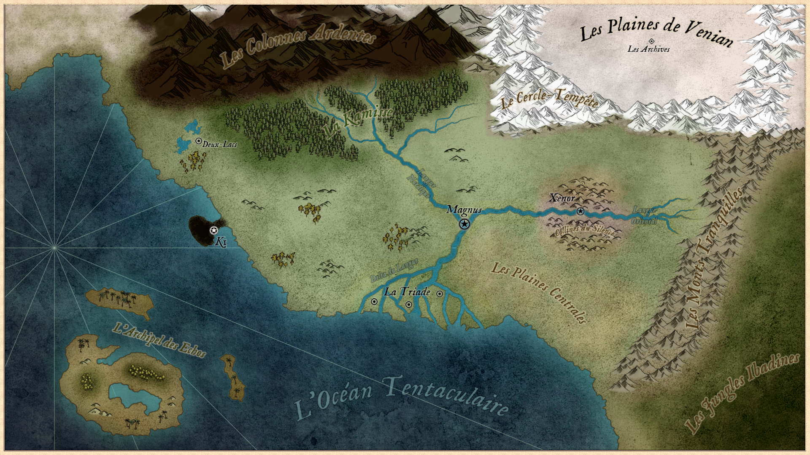

# Royaume de Fellir

> 581 - 1000? po.

## La Royauté

Après plusieurs mois d’anarchie, une nouvelle famille décida de créer un nouveau royaume centrée sur Magnus, un bourg modeste à l’intersection du Langue Oriental et du Langue Nordique. Ce semblant de civilisation rassembla les diverses factions éclatées après la chute du Consortium sous la bannière de Fellir (Fellir, initiales du nom “unité” dans chacune des langues des six races majeures de Zoryn).

## La Révolte de Rovnos

“La Révolte” est le nom que la populace lui donne. Depuis l’an 781, Rovnos est un nom que l’on évite de prononcer. Il est tout à la fois synonyme de mort et de malchance. Beaucoup pensent que seule son évocation amènera le mauvais sort sur leur personne. Tout historien qui se respecte doit cependant faire fit des risques mystiques et relater l’Histoire tel que les contemporains l’ont vécu. Comme le veut l’adage, “Le passé ne craint pas le présent”. 

Dans le delta, au Sud-Ouest de Fellir, siégeait la deuxième plus grande ville du Royaume de Fellir. Avec la disparition de l’ancienne capitale, un vide avait été laissé et le comptoir de Rovnos s’est chargé de le combler. Rien qu’un village de pêcheur et une étape pour les voyageurs peu pressés, le bourg s’est vu soudain assailli d’entrepreneurs et autres commerçants. En seulement quelques années, le bourg est devenu ville et une toute nouvelle bourgeoisie s’est installée à la tête de la cité. 

L’ascension de cette élite a remué une bonne partie de la noblesse Fellirienne. Les relations entre Magnus et Rovnos se sont enflammées et ont mené à un conflit ouvert. Au 200e anniversaire de la fondation du Royaume, Rovnos s’est déclarée République Indépendante. Les nobles ont poussé le roi de l’époque Gothric Ier à riposter promptement. Bien qu’en désavantage tactique - Rovnos avait eu le temps d'entraîner et recruter sa propre armée - Gothric Ier était politiquement coincé. 

La guerre fût déclarée dans les jours qui suivent, l’armée royale marchant sur le delta. Cependant, le combat était âpre. La première ligne peinait à avancer, l’ennemi avait l’avantage du terrain et savait s’en servir. L’été fut épouvantable pour les attaquants dans le marais du delta. Les insectes causaient des ravages mais le pire restait la dégradation progressive de l’hygiène. Les maladies se répandent à une vitesse affolante et décimait les rangs. Les blessés ne survivaient jamais plus de quelques jours, les infections étaient toujours fatales.

Le roi, désespéré, sentant son pouvoir s’amenuiser à mesure que la guerre tournait à la débâcle, fit appel à toutes les compagnies de mercenaires disponibles. Lors de son ultime discours à son armée nouvellement renflouée, il ordonna à ses hommes d’utiliser tous les moyens nécessaires pour anéantir les forces ennemies dans un assaut frontal prévu pour l’aube. Quand le reste de l’armée se leva, ce n’était pas le soleil qui éclairait le champ de bataille, mais bien les flammes de Rovnos. La cité tomba dans le feu et la douleur de la main d’un groupuscule de mages entreprenants. Le peu d’habitants de Rovnos, civils ou militaires, qui tentèrent de fuir l’incendie fûrent cueillis et massacrés sans autre forme de procès dans les marais. L’armée royale obéissait à la lettre…

Les régiments qui furent impliqués dans l’assaut nocturne formèrent une guilde de mercenaires indépendants qui sera nommé le Lac Rouge.

## Gouvernement

Le gouvernement actuel de Rovnos est composé de deux parties : le Roi, chef quasi-suprême de Fellir et le Conseil des Ministres. Bien que le Roi ait la majorité des pouvoirs, la plupart de ses décisions doivent être approuvée par le conseil et inversement. Historiquement, le Conseil est composé de 10 membres élus parmis la noblesse et bien sûr, du Roi pour un total de 11. Il existe de très rares cas où des personnalités influentes issues de la bourgeoisie ou du bas peuple furent élus. Soient ils s’étaient distingués par des actions héroïques lors de guerres (les généraux Ethan et Ljuk élus respectivement en 612 et 781), soient les jeux de diplomatie ont forcé le conseil à accueillir temporairement un conseiller étranger. 

La loi stipule que les membres du Conseil ne peuvent rester plus de 10 ans dans leur fonction, mais dans la pratique, cette loi n’a jamais eu à s’appliquer. Plus de 400 ans d’existence du Conseil et jamais un magistrat n’a pu terminer son mandat. Voyez-vous, une place au Conseil dépend beaucoup de votre faveur auprès du peuple. Si votre réputation est ternie d’une quelconque manière, vous ne survivrez pas longtemps au Conseil. Nombreux sont les nobles qui convoitent votre poste de prestige, autant d’ennemis dont il faut se méfier… Et si la moindre faille est décelée, elle sera exploitée et vous serez évincé. Plus ou moins violemment. On ne compte plus le nombre de magistrats partis prendre leur “retraite” dans la campagne ou ceux qui sont subitement tombés grièvement “malades” la veille d’un vote. Cet écosystème pour le moins dangereux arrive cependant toujours à un équilibre et le pays se porte on ne peut mieux.

## Magnus, la capitale

Magnus est construite sur les ruines de ce qui fut par le passé Miden. Des grands travaux de terraformation ont menés aux deux anneaux-lacs qui entourent la cité. Le lac intérieur est situé au centre de la cité, tandis que le lac extérieur entoure Magnus. Les branches du Langue sont directement reliées au lac extérieur. Les deux lacs sont reliés par divers canals. Le lac intérieur communique avec la branche Sud du Langue via un tunnel monumental. Cet accès permet à un vaisseau-cité Octocide de s’installer dans le lac intérieur en remontant le Langue. En plus des accès aquatiques, l’île-cité est reliée au continent par une formation granitique artificielle. Au Nord de la ville, elle forme un pont titanesque de plusieurs dizaines de kilomètres de long et quasiment 600 mètres de haut. L’édifice est creusé et majoritairement habité par les communautés Omtaupi de la ville.

Le quartier Sud de Magnus accueille le palais royal sur plusieurs dizaines de kilomètres carrés. Au sein du palais se retrouve en plus des appartements royaux, les diverses salles du Conseil et salles d’audience du roi. Les Ministres logent également sur place dans des appartements souvent modifiés pour être aux goûts de chaque occupant. Enfin, la cour du roi et les familles nobles ont également des quartiers dans le palais royal, bien que de nombreux comtes et ducs préfèrent leurs résidences en dehors de Magnus, moins écrasés par l'exubérance du pouvoir royal.

## Le Bazar

Le Bazar est le nom officieux puis officiel donné au marché noir de Magnus. Bien que les autorités aient énormément de mal à en déterminer la localisation et les membres, de nombreuses histoires fuitent du quartier général de la contrebande en Zoryn. Le roi a tenté à maintes reprises de se débarrasser de cette épine mais n’y est jamais parvenu jusqu’à présent.
